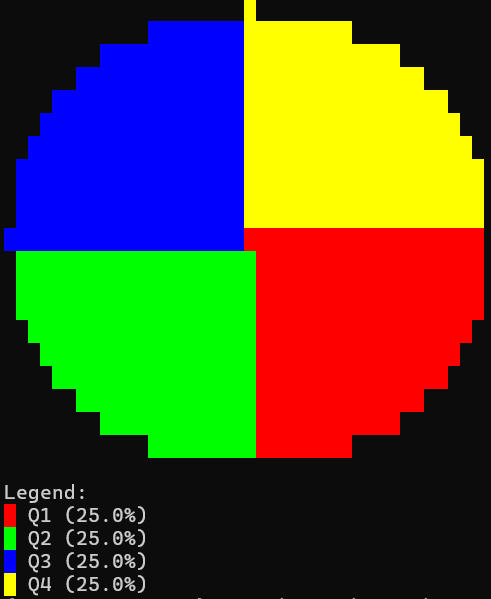

# 📊 Terminal Plot with ANSI

A lightweight CLI-based plotting tool that brings basic data visualization to your terminal using **ANSI characters and colors**. Inspired by [Matplotlib](https://matplotlib.org/), it supports:

* 📈 Line plots
* 🔵 Scatter plots
* 📊 Bar charts
* 🥧 Pie charts

All rendered **directly in the terminal**, with no GUI required.

---

## Examples

### 🔵 Scatter Plot

```bash
cmd_plot scatter --x "1,2,3,4,5" --y "10,5,20,15,30" --title "Scatter Example"
```


---

### 📈 Line Plot

```bash
cmd_plot line --x "1,2,3,4,5" --y "10,5,20,15,30" --title "Line Plot Example"
```

This command renders a line graph using ANSI characters for smooth, colorful output in the terminal.


---

### 📊 Bar Chart

```bash
cmd_plot bar --data "5,15,25,35" --labels "Alpha,Beta,Gamma,Delta"
```

Renders a vertical bar chart with labeled categories.


---

### 🥧 Pie Chart

```bash
cmd_plot pie --data 25,25,25,25 --labels Q1,Q2,Q3,Q4 --size 20
```

Generates a proportional pie chart using ASCII/ANSI graphics.



---

## Dependencies

Make sure you have the following Python libraries installed:

* [`click`](https://palletsprojects.com/p/click/)
* [`numpy`](https://numpy.org/)

To install them with Poetry:

```bash
poetry add click numpy
```

---

## Setup with Poetry

```bash
poetry shell        # Activate virtual environment
poetry install      # Install all dependencies
```
